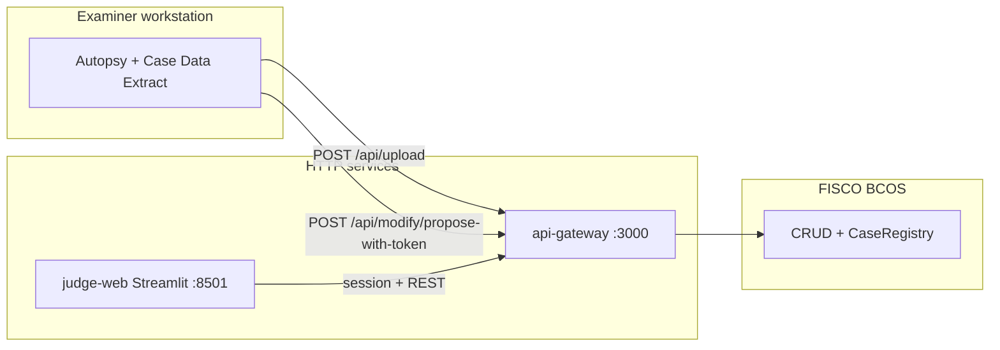

Welcome to the **[Blockchain Enhanced Autopsy System](https://github.com/dantin-github/Blockchain-enhanced-Autopsy-system)** wiki.

# Blockchain Enhanced Autopsy System — Wiki

End-to-end forensic export, integrity checks, optional hash anchoring on **FISCO BCOS**, and **two-party** case updates (police proposal + court approval) via **api-gateway** and **Judge Web**.

**Target stack:** **Autopsy 4.22.1** · Java 17 · Core JAR patch installation (not standard NBM-only install on this version).

## Table of contents

* [System overview](#system-overview)
* [Architecture](#architecture)
* [Repository components](#repository-components)
* [Case Data Extract plugin](#case-data-extract-plugin)
  * [Operation log](#operation-log)
  * [JSON report export](#json-report-export)
  * [Image integrity verification](#image-integrity-verification)
  * [Optional blockchain upload](#optional-blockchain-upload)
  * [Optional modification proposal](#optional-modification-proposal)
* [How data is obtained](#how-data-is-obtained)
* [Installation](#installation)
* [Usage](#usage)
* [Report JSON structure](#report-json-structure)
* [Project structure](#project-structure)
* [API gateway & Judge Web](#api-gateway--judge-web)
* [Blockchain module](#blockchain-module)
* [Why core JAR patching?](#why-core-jar-patching)
* [Known limitations](#known-limitations)
* [Troubleshooting](#troubleshooting)
* [Development notes](#development-notes)

---

## System overview

**Case Data Extract** is an Autopsy report module that produces a **structured JSON** audit of case metadata, operations, data sources, and every file record, plus an **aggregate SHA-256** over the report body.

The same repository also ships:

| Component | Path | Role |
|-----------|------|------|
| Autopsy plugin | `src/.../caseextract/` | Export, operation log, image re-hash on case open, optional upload / propose |
| API gateway | `api-gateway/` | HTTP API — `POST /api/upload`, `POST /api/query`, modify flow, audit (`:3000`) |
| Judge Web | `judge-web/` | Streamlit dashboard for judges — HTTP to gateway only (`:8501`) |
| Blockchain helpers | `blockchain/`, `blockchain-setup/` | FISCO BCOS SDK, scripts, optional WeBASE |

Solid reference paths in-repo: **`api-gateway/README.md`**, **`judge-web/README.md`**, **`docs/evidence/`** (thesis / evidence pack).

---

## Architecture

```
┌─────────────────────────────────────────────────────────┐
│                   Autopsy 4.22.1                        │
│                                                         │
│  Case Events ──► CaseEventRecorder ──► case_extract_    │
│  (open/close,     (listener +           events.json     │
│   add source,      operation log)       (in case dir)   │
│   add report…)         │                                │
│                        │ on case open                   │
│                        ▼                                │
│                 Background Thread                       │
│                 (hash physical                          │
│                  image files)                           │
│                        │                                │
│  Tools →               │ results                        │
│  Generate Report       ▼                                │
│       │        CaseDataExtractMonitorTopComponent       │
│       │        ┌─────────────┬──────────────────┐       │
│       │        │ Operations  │ Image Integrity   │       │
│       │        │ Log         │ (live hash check) │       │
│       │        └─────────────┴──────────────────┘       │
│       ▼                                                 │
│  CaseDataExtractReportModule                            │
│  → case_data_extract.json                               │
│    (case meta + op log + data source hashes +           │
│     full file listing + aggregate SHA-256)              │
└─────────────────────────────────────────────────────────┘
          │ optional upload / propose
          ▼
   ┌──────────────┐     ┌─────────────┐     ┌──────────────┐
   │ api-gateway  │ ──► │ FISCO BCOS  │     │ judge-web    │
   │  :3000       │     │ (CRUD /     │ ◄── │  :8501       │
   └──────────────┘     │  Registry)  │     └──────────────┘
                        └─────────────┘       (HTTP to gateway)
```

---

## Repository components



After a judge **approves** a modification on Judge Web, the gateway **auto-executes** the on-chain proposal (police do not run a separate `execute` step from Autopsy). See `docs/evidence/autopsy-upload/proposal-flow/` for evidence-style checklists and samples.

---

## Case Data Extract plugin

### Operation log

Every significant case event is recorded with a timestamp, examiner name, and detail string:

| Event type | Triggered when |
| ---------- | -------------- |
| CASE_OPENED | Case opened (including restore on startup) |
| CASE_CLOSED | Case closed |
| DATA_SOURCE_ADDED | Image or logical source added |
| ADDING_DATA_SOURCE | Ingestion begins |
| ADDING_DATA_SOURCE_FAILED | Ingestion fails |
| REPORT_ADDED | Any report generated |
| CASE_DETAILS | Case metadata edited |
| INTEGRITY_FAIL | Image file hash ≠ stored reference |

The log is written to **`<case directory>/case_extract_events.json`** after each event.

---

### JSON report export

**Tools → Generate Report → Case Data Extract Report.**

Output path pattern:

```
<case directory>/Reports/<run label>/CaseDataExtract/case_data_extract.json
```

Sections:

1. **Case metadata** — Case ID, display name, examiner, timestamps  
2. **Operation log** — Trail from `case_extract_events.json`  
3. **Data sources** — Paths, MD5, SHA-256  
4. **File listing** — Every file with metadata and hashes (when ingest provided them)  
5. **Aggregate hash** — Single SHA-256 over the canonical report body (hash fields empty during computation)

---

### Image integrity verification

On each case open the module:

1. Finds the latest `case_data_extract.json` under the case `Reports/` tree  
2. Reads reference SHA-256 per data source from that report  
3. Background-thread full-file SHA-256 of physical image bytes  
4. Updates the **Image Integrity** tab (refresh ~2 s)

| Status | Meaning |
| ------ | ------- |
| Checking… N% | Hash in progress |
| OK — integrity verified | Matches reference |
| TAMPERED — hash mismatch! | File may have changed |
| No reference hash… | First run or no prior report |
| Error: file not found | Path missing |

On mismatch, **INTEGRITY_FAIL** is appended to the operation log.

> **E01:** DB hash vs physical file hash differ; use the **report** hash as reference (generate once after ingest, compare on later opens). Raw `dd`/`img` images align more directly.

---

### Optional blockchain upload

If upload is enabled in the report settings with a valid **gateway base URL** and **police OTP**, the module `POST`s the new JSON to **api-gateway** (`/api/upload`). Outputs include `upload_receipt.json`, `uploadStatus` on the main report, and **Window → Case Data Extract Status → Upload Status**.

---

### Optional modification proposal

Mutually exclusive with upload: **Submit as modification proposal** calls **`POST /api/modify/propose-with-token`** and writes **`proposal_receipt.json`**. After judicial approval, the gateway completes execution. See **`README.md`** and **`docs/evidence/autopsy-upload/`** for details.

---

## How data is obtained

All data uses **Autopsy’s Java API** (not raw `case.db` scraping for the main paths).

```
case.db (SQLite)
├── tsk_image_info  ──► Image paths / MD5 / SHA-256
└── tsk_files       ──► SleuthkitCase file enumeration + AbstractFile metadata

Case metadata (*.aut XML) ──► Case ID, examiner, dates, display name

Operation log  ──► Case.addEventTypeSubscriber → case_extract_events.json

Physical bytes  ──► FileInputStream (integrity check only)
```

---

## Installation

### Prerequisites

| Requirement | Details |
| ----------- | ------- |
| Autopsy | 4.22.1 (paths below assume default install folder) |
| OS | Windows 10 / 11 (`build-patch-core.bat`, `install-patch-core.bat`) |
| Rights | Administrator for installing the patched core JAR |

No separate JDK install — the build uses Autopsy’s bundled JDK.

---

### Step 1 — Copy the original core JAR

**Not** in git (Sleuth Kit redistribution). Copy once:

**From:**  
`C:\Program Files\Autopsy-4.22.1\autopsy\modules\org-sleuthkit-autopsy-core.jar`  

**To:**  
`<project root>\patch\core.jar`

---

### Step 2 — Build

From the repo root:

```powershell
.\build-patch-core.bat
```

Produces **`patch\org-sleuthkit-autopsy-core-patched.jar`**.

---

### Step 3 — Install

1. **Close Autopsy completely**  
2. **Right-click `install-patch-core.bat` → Run as administrator**  
3. The script backs up the live core JAR to **`org-sleuthkit-autopsy-core.jar.bak`**, copies the patched JAR, and clears critical NetBeans cache files under `%LOCALAPPDATA%\autopsy\Cache\dev\`

Start Autopsy — **Case Data Extract Report** and **Window → Case Data Extract Status** should register.

---

### Uninstalling

Restore the backup (Administrator shell example):

```powershell
Copy-Item "C:\Program Files\Autopsy-4.22.1\autopsy\modules\org-sleuthkit-autopsy-core.jar.bak" `
          "C:\Program Files\Autopsy-4.22.1\autopsy\modules\org-sleuthkit-autopsy-core.jar" -Force
```

If the UI still looks stale, delete the NetBeans platform cache files under `%LOCALAPPDATA%\autopsy\Cache\dev\` (same filenames `install-patch-core.bat` removes).

---

## Usage

### Status window

- **Toolbar:** plugin icon (same row as Keyword Search)  
- **Menu:** **Window → Case Data Extract Status**  
Auto-refresh about every 2 seconds.

### Operations Log tab

Sortable table: time, action type, operator, detail.

### Image Integrity tab

Per image source: path, status, computed SHA-256, reference from last report (or DB when no report).

**Recommended:** add data source → generate **Case Data Extract** once → later opens compare to that report.

### Generating a report

**Tools → Generate Report → Case Data Extract Report** — pick output folder → **Generate**. Large cases: file listing can take many minutes.

---

## Report JSON structure

Illustrative shape (fields evolve with the module — always inspect a fresh export):

```json
{
  "caseId": "2024-001",
  "caseDisplayName": "Example Case",
  "examiner": "J. Smith",
  "createdDate": "2026-01-15 09:00:00",
  "operations": [
    {
      "time": "2026-01-15 09:01:23",
      "action": "CASE_OPENED",
      "operator": "J. Smith",
      "detail": "Example Case | OS user: jsmith"
    }
  ],
  "dataSources": [
    {
      "name": "evidence.dd",
      "paths": ["C:\\Evidence\\evidence.dd"],
      "md5": "…",
      "sha256": "…"
    }
  ],
  "files": [ { "name": "…", "path": "…", "size": 0, "sha256": "…" } ],
  "aggregateHash": "…",
  "aggregateHashNote": "SHA-256 of this JSON with aggregateHash fields empty (UTF-8)"
}
```

---

## Project structure

```
project root/
├── src/org/sleuthkit/autopsy/report/caseextract/   ← Plugin sources
├── install-config/
│   ├── core-layer-patched.xml
│   └── core-GeneralReportModule-services.txt
├── patch/
│   ├── core.jar                         ← not in git — you copy from Autopsy
│   └── org-sleuthkit-autopsy-core-patched.jar  ← build output (not in git)
├── build-patch-core.bat
├── install-patch-core.bat
├── api-gateway/
├── judge-web/
├── blockchain/
├── blockchain-setup/
└── README.md
```

---

## API gateway & Judge Web

* **api-gateway** — Node/Express: police OTP, judge session, `POST /api/upload`, `POST /api/query`, modification routes, audit stream. Configure from **`api-gateway/.env.example`**. Default dev: **`npm run dev`** on port **3000**.  
* **judge-web** — Streamlit on **8501**; browser never holds chain keys — only talks to the gateway. See **`judge-web/README.md`**.

Dissertation evidence indices: **`docs/evidence/`**, **`docs/evidence/judge-web/`**.

---

## Blockchain module

| Path | Role |
|------|------|
| `blockchain/` | Java SDK — hashing, private record store, chain I/O |
| `blockchain-setup/` | WSL / FISCO BCOS / WeBASE scripts |

**Hash-only on chain:** index keyed by hash of case id; record integrity via hash of payload. Full plaintext stays off-chain unless you choose otherwise.

**Two-party modifications:** police propose → court approves → executor runs on chain (see **`blockchain-setup/TWO-PARTY-MODIFICATION.md`** when present).

Quick chain bring-up (from **`blockchain/README.md`** / **`blockchain-setup/README.md`**):

1. WSL: `bash blockchain-setup/2-setup-fisco.sh`  
2. Console: create `t_case_hash` as required by your deployment  
3. Optional WeBASE: `bash blockchain-setup/3-setup-webase.sh`

---

## Why core JAR patching?

Autopsy **4.22** often **rejects** standard NBMs (`AutoupdateInfoParser` XML mismatch) and the platform **classloader** may ignore loosely dropped JARs. Injecting classes **into** `org-sleuthkit-autopsy-core.jar` makes the plugin part of the **core** module from the platform’s perspective — registration and caches stay on the supported path. **Do not rely on NBM-only install on 4.22** per this project’s findings.

---

## Known limitations

| Topic | Detail |
| ----- | ------ |
| Windows-first | Batch install path; Java code is largely portable |
| Version lock | Patch targets **4.22.x** core layout |
| E01 hashes | Physical file hash vs logical-image hash differ — use report reference |
| Empty file hashes | Require Hash Lookup ingest (or equivalent) to populate |
| Huge cases | Full file list walks all `tsk_files` rows — can be slow |

---

## Troubleshooting

| Symptom | What to try |
| ------- | ----------- |
| “Waiting for image data sources…” forever | Ensure an **Image**-type source exists; wait ~10 s; recheck data source type |
| Report write failure | Output folder writable; path length / AV locks |
| Tabs empty after restart | Delete `%LOCALAPPDATA%\autopsy\Cache\dev\*.dat` (while Autopsy closed); reinstall patch |
| Module missing under **Generate Report** | Re-run **`install-patch-core.bat`** as Administrator; verify `messages.log` for `caseextract` |

**Logs:** **Help → Open Log Folder** or `%APPDATA%\autopsy\var\log\` — search `caseextract`, `SEVERE`, `Exception`.

---

## Development notes

* **New operation-log event:** extend `CaseEventRecorder` subscriber `EnumSet` in **`CaseEventRecorder.java`**.  
* **Rebuild loop:** close Autopsy → `build-patch-core.bat` → `install-patch-core.bat` → reopen.  
* **Report fields:** edit **`CaseDataExtractReportModule.java`**. Anything included in integrity should enter **before** aggregate hash computation.

---

_Research build for dissertation-scale forensic integrity. Not affiliated with or endorsed by Autopsy / Sleuth Kit._
